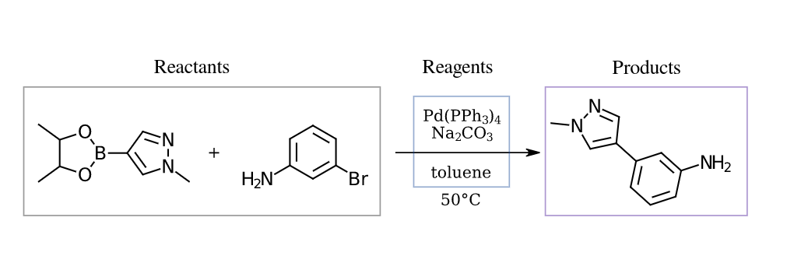

# Molecular Transformer for Reagents Prediction

This is the code for the
paper [Reagent Prediction with a Molecular Transformer Improves Reaction Data Quality](https://doi.org/10.1039/D2SC06798F).  
The repository is effectively a fork of the [Molecular Transformer](https://github.com/pschwllr/MolecularTransformer).

Idea:

* Train a transformer to predict reagents for organic reactions in the way of SMILES-to-SMILES translation.
  
* Infer missing reagents for some reactions in the training set.
* Train a transformer for reaction product prediction on the dataset with improved reagents.


## Installation

1. Create a conda environment with python 3.10
   ```bash
   conda create -n reagents python=3.10 -y
   conda activate reagents
   ```
2. Install dependencies via `pip`
   ```bash
   pip install -r requirements.txt --no-deps
   ```
3. Install Pytorch separately

* With GPU

   ```bash
   pip install torch==1.13.1+cu117 -f https://download.pytorch.org/whl/torch_stable.html
   ```

* Without GPU

   ```bash
   pip install torch==1.13.1 -f https://download.pytorch.org/whl/torch_stable.html
   ```

## Data

Prepare or download the tokenized datasets and put them in the `data/tokenized` directory.
  * Product prediction (USPTO MIT mixed): [Google Drive](https://drive.google.com/drive/folders/1fJ7Hm55IDevIi5Apna7v-rQBQStTH7Yg)
  * Product prediction (USPTO MIT separated): [Google Drive](https://drive.google.com/drive/folders/1kiTsRRo2MnA8eJYjIvUsw9Zw1eMApVwG)
  * Product prediction (USPTO MIT mixed, replaced reagents): [Google Drive](https://drive.google.com/drive/folders/1X2V0TVmakKH3-OCV1bIBDtZsLhMUyRgo)
  * Product prediction (USPTO MIT separated, replaced reagents): [Google Drive](https://drive.google.com/drive/folders/1xT0CMpREIzbzjuWFkhjJ0k1Shs9ssZkH)  
  * Reagent prediction (USPTO full with no reactions from USPTO MIT test): [Google Drive](https://drive.google.com/drive/folders/1AUF7_LeCUcHSUlr48IS1cXfQ14_Y1Gxc).  

The dataset for reagent prediction was obtained from full USPTO taken from [here](https://ibm.ent.box.com/v/ReactionSeq2SeqDataset) using the `prepare_data.py` script.

It's possible to download the data using `gdown` (installed with other requirements from requirements.txt)
   ```bash
   # USPTO MIT mixed
   gdown https://drive.google.com/drive/folders/1fJ7Hm55IDevIi5Apna7v-rQBQStTH7Yg -O data/tokenized/MIT_mixed --folder
   # USPTO MIT separated
   gdown https://drive.google.com/drive/folders/1kiTsRRo2MnA8eJYjIvUsw9Zw1eMApVwG -O data/tokenized/MIT_separated --folder
   # USPTO MIT mixed, replaced reagents
   gdown https://drive.google.com/drive/folders/1X2V0TVmakKH3-OCV1bIBDtZsLhMUyRgo -O data/tokenized/MIT_mixed_new --folder
   # USPTO MIT separated, replaced reagents
   gdown https://drive.google.com/drive/folders/1xT0CMpREIzbzjuWFkhjJ0k1Shs9ssZkH -O data/tokenized/MIT_separated_new --folder
   # USPTO full with no reactions from USPTO MIT test
   gdown https://drive.google.com/drive/folders/1AUF7_LeCUcHSUlr48IS1cXfQ14_Y1Gxc -O data/tokenized/reagents_no_MIT_test --folder
   ```

## Model training and testing

Train a reagents prediction model (e.g. for MIT_mixed):  
   First, build vocabularies for an OpenNMT model:
   ```bash
       onmt_build_vocab -config data/tokenized/MIT_mixed/MIT_mixed.yml -n_sample -1
   ```

   Then, train a model:
   ```bash
       onmt_train -config data/tokenized/MIT_mixed/MIT_mixed.yml -tensorboard -tensorboard_log_dir runs/MIT_mixed -world_size 1 -gpu_ranks 0
   ```

   Make predictions with a trained model (takes tokenized data and produces tokenized predictions):
   ```bash
      onmt_translate -model <CHECKPOINT>.pt -src data/tokenized/MIT_mixed/src-test.txt -output data/tokenized/MIT_mixed/pred-val.txt \
                     -beam_size 5 -n_best 5 -batch_size 64 -gpu 0 
   ```
   Make predictions for untokenized reactions and obtain untokenized predicted SMILES:
   ```bash
   python3 inference.py --task <reagents/products> --data <untokenized SMILES, .txt> --model <checkpoint, .pt>
   ```
   For more information run `python3 inference.py --help`
The checkpoints will be saved to the directory under "save_model" in the config.  
By default for MIT_mixed it's `experiments/checkpoints/MIT_mixed/`

Trained models can be downloaded [here](https://drive.google.com/drive/folders/1weP5wG_wzd9qb3RVnCz0JjyB-TJF-5yQ?usp=sharing).

## Workflow

1. Download the datasets and put them in the `data/tokenized` directory.

2. Train a reagents prediction model:

3. Train a basline product prediction model:  
   Train a Molecular Transformer on, say, `MIT_separated` data.

4. Use a trained reagent model to improve reagents in a dataset for product prediction.   
   The script `reagent_substitution.py` uses a reagents prediction model to change reagents in data which is the input  
   to a product prediction model. To change the reagents in, say, `MIT_separated`, run the script as follows:
   ```bash
       python3 reagent_substitution.py --data_dir data/tokenized/MIT_separated \ 
                                       --reagent_model <MODEL_NAME> \ 
                                       --reagent_model_vocab <MODEL_SRC_VOCAB> \
                                       --beam_size 5 --gpu 0
   ```
   `MODEL_NAME` may be stored, in `experiments/checkpoints/`.
   `MODEL_SRC_VOCAB` (a .json file )may be stored in `data/vocabs/`.  
   Or download the final
   data [here](https://drive.google.com/drive/folders/1Cr8AsAIYSGaXJuBnlVflBax3ZbEbq89s?usp=sharing).

7. Train product prediction models on datasets cleaned by a reagents prediction model like in step 5.

The trained reagent and product models in the forms of `.pt` files are
stored [here](https://drive.google.com/drive/folders/1weP5wG_wzd9qb3RVnCz0JjyB-TJF-5yQ).

## Inference

To make predictions for reactions supplied in a .txt file as SMILES, use the following script:

    ```bash
        python3 translate.py -model <PATH TO THE MODEL WEIGHTS> \
                    -src <PATH TO THE TEST REACTIONS WITHOUT REAGENTS> \
                    -output <PATH TO THE .TXT FILE WHERE THE PREDICTIONS WILL BE STORED> \
                    -batch_size 64 -replace_unk -max_length 200 -fast -beam_size 5 -n_best 5 -gpu <GPU ID>
    ```

The supplied reactions should be tokenized with tokens separated by spaces, like in files produced by `prepare_data.py`.

## Citation

The preprint:

```
@article{andronov_voinarovska_andronova_wand_clevert_schmidhuber_2022, 
 place={Cambridge}, 
 title={Reagent Prediction with a Molecular Transformer Improves Reaction Data Quality}, 
 DOI={10.26434/chemrxiv-2022-sn2kr}, 
 journal={ChemRxiv},
 publisher={Cambridge Open Engage}, 
 author={Andronov, Mikhail and Voinarovska, Varvara and Andronova, Natalia and Wand, Michael and Clevert, Djork-Arné and Schmidhuber, Jürgen}, 
 year={2022}
 } 
```

The underlying framework:

```
@inproceedings{opennmt,
  author    = {Guillaume Klein and
               Yoon Kim and
               Yuntian Deng and
               Jean Senellart and
               Alexander M. Rush},
  title     = {Open{NMT}: Open-Source Toolkit for Neural Machine Translation},
  booktitle = {Proc. ACL},
  year      = {2017},
  url       = {https://doi.org/10.18653/v1/P17-4012},
  doi       = {10.18653/v1/P17-4012}
}
```
